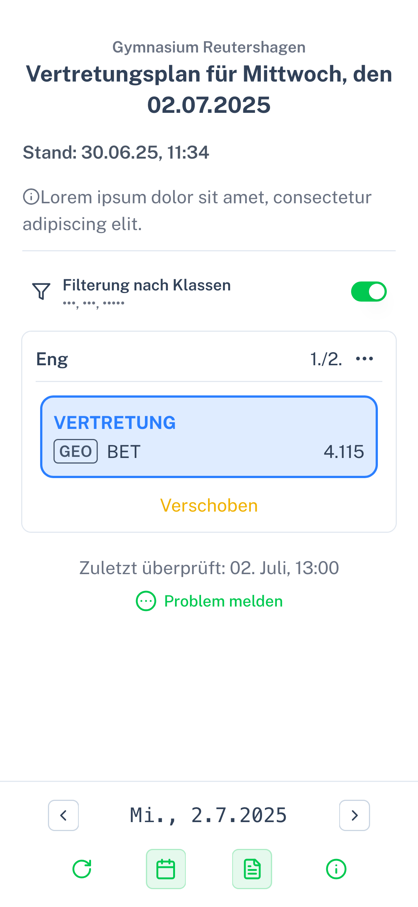

# Advanced Vertretungsplan

This is a little web app I made for fellow students of my school to view the substitution plan in a nice and functional UI.

Every day, the substitution plan gets uploaded to an itslearning course in PDF format. This is often annoying and slow to open though, so I had the idea to write a script that automatically logs in, downloads the plan and provides it to the students.
And why not combine that with an awesome interface?

  

So, this is Advanced Vertretungsplan!

## Features

- View the plan for the current day or any other day
- Responsive designs with cards and lists
- Download the plan as a PDF
- Filter by whatever class you’re in
- Dark mode support
- Admin dashboard to view & fix issues
- Easy to use and navigate

This project was made in collaboration with [@Byteflow-Reutershagen](https://github.com/Byteflow-Reutershagen).
